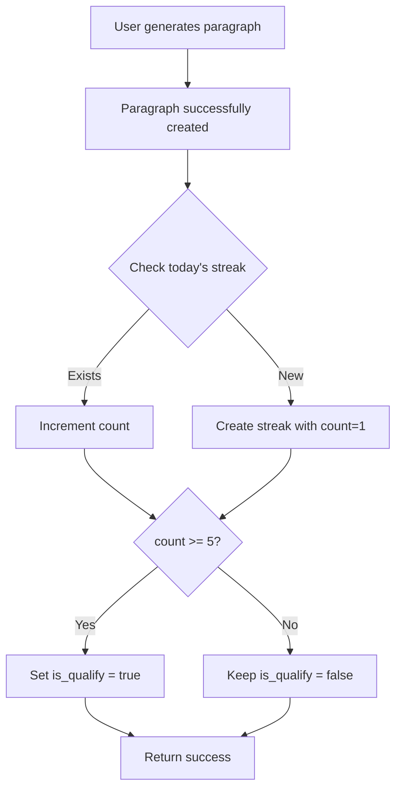

# Streak Feature Update - Count & Qualify Fields

## 🆕 What's New?

The streak collection now includes two additional fields to track user progress:
- **`count`**: Tracks how many paragraphs have been generated on a given day
- **`is_qualify`**: Automatically set to `true` when count reaches 5

## 📊 Updated Database Schema

### Collection: `streak`

| Field | Type | Description | Default |
|-------|------|-------------|---------|
| `_id` | ObjectId | Unique identifier | Auto-generated |
| `user_id` | ObjectId | Reference to users collection | Required |
| `learned_date` | Date | Date when learning occurred | Required |
| `step` | Integer | Progress step for the day | 1 |
| **`count`** | **Integer** | **Number of paragraphs generated** | **null → 1 on first creation** |
| **`is_qualify`** | **Boolean** | **True when count >= 5** | **false** |
| `created_at` | DateTime | When the record was created | Current UTC time |

## 🎯 Key Features

### 1. Automatic Count Increment
Every time a user generates a paragraph, the streak for that day is automatically updated:
- **First paragraph**: `count = 1`
- **Second paragraph**: `count = 2`
- **Third paragraph**: `count = 3`
- ...and so on

### 2. Auto-Qualification
When a user generates 5 or more paragraphs in a single day:
- `is_qualify` automatically changes from `false` to `true`
- This marks the day as "qualified" for special achievements/rewards

## 🔄 How It Works

### Paragraph Generation Flow



### Example Scenario

**User generates 7 paragraphs on October 11, 2025:**

| Paragraph # | Count | is_qualify | Note |
|------------|-------|------------|------|
| 1st | 1 | false | First of the day |
| 2nd | 2 | false | |
| 3rd | 3 | false | |
| 4th | 4 | false | |
| **5th** | **5** | **true** | Qualified! 🎉 |
| 6th | 6 | true | Still qualified |
| 7th | 7 | true | Still qualified |

## 📡 Updated API Responses

### POST /api/v1/generate-paragraph

Now automatically creates/updates streak after successful paragraph generation.

**Response remains the same** (paragraph generation response), but streak is updated in the background.

### POST /api/v1/streak

**Response:**
```json
{
  "id": "67098abc123def456789",
  "user_id": "67098abc123def456789",
  "learned_date": "2025-10-11",
  "step": 1,
  "count": 3,              // NEW: Number of paragraphs generated
  "is_qualify": false,     // NEW: True when count >= 5
  "created_at": "2025-10-11T10:30:00.000Z",
  "status": true
}
```

### GET /api/v1/streak-chain

**Response:**
```json
{
  "id": 12345678,
  "start_date": "2025-10-01",
  "end_date": "2025-10-11",
  "dates": [
    {
      "date": "2025-10-01",
      "completed": false,
      "count": null,         // NEW: No activity this day
      "is_qualify": false    // NEW: Not qualified
    },
    {
      "date": "2025-10-02",
      "completed": true,
      "count": 3,            // NEW: Generated 3 paragraphs
      "is_qualify": false    // NEW: Not qualified yet
    },
    {
      "date": "2025-10-03",
      "completed": true,
      "count": 7,            // NEW: Generated 7 paragraphs
      "is_qualify": true     // NEW: QUALIFIED! ✨
    }
  ],
  "total_days": 11,
  "completed_days": 2,
  "qualified_days": 1,       // NEW: Days with count >= 5
  "status": true
}
```

## 💻 Frontend Integration Examples

### Display Qualification Status

```javascript
const StreakDay = ({ date, count, is_qualify, completed }) => {
  return (
    <div className={`streak-day ${is_qualify ? 'qualified' : ''}`}>
      <div className="date">{date}</div>
      {completed && (
        <>
          <div className="count">
            {count} {count === 1 ? 'paragraph' : 'paragraphs'}
          </div>
          {is_qualify && (
            <div className="badge">⭐ Qualified!</div>
          )}
        </>
      )}
    </div>
  );
};
```

### Track Progress Toward Qualification

```javascript
const TodayProgress = ({ todayStreak }) => {
  const progress = todayStreak?.count || 0;
  const remaining = Math.max(0, 5 - progress);
  
  return (
    <div className="progress-tracker">
      <h3>Today's Progress</h3>
      <div className="progress-bar">
        <div 
          className="fill" 
          style={{ width: `${Math.min(100, (progress / 5) * 100)}%` }}
        />
      </div>
      <p>
        {progress} / 5 paragraphs
        {remaining > 0 ? ` (${remaining} more to qualify!)` : ' ✨ Qualified!'}
      </p>
    </div>
  );
};
```

### Show Qualification Rate

```javascript
const getStreakStats = async (startDate, endDate) => {
  const response = await fetch(
    `http://localhost:8000/api/v1/streak-chain?startday=${startDate}&endday=${endDate}`,
    { headers: { 'Authorization': `Bearer ${token}` } }
  );
  
  const data = await response.json();
  
  const stats = {
    totalDays: data.total_days,
    activeDays: data.completed_days,
    qualifiedDays: data.qualified_days,
    qualificationRate: data.completed_days > 0 
      ? (data.qualified_days / data.completed_days * 100).toFixed(1) 
      : 0
  };
  
  return stats;
};

// Usage
const stats = await getStreakStats('2025-10-01', '2025-10-31');
console.log(`Qualification Rate: ${stats.qualificationRate}% (${stats.qualifiedDays}/${stats.activeDays} days)`);
```

## 🎮 Gamification Ideas

### Achievement Badges
- **"Getting Started"**: First qualified day (count >= 5)
- **"Dedicated Learner"**: 7 qualified days in a row
- **"Power User"**: 10+ paragraphs in a single day
- **"Consistent"**: 30 qualified days in a month

### Progress Levels
```javascript
const getLevel = (totalQualifiedDays) => {
  if (totalQualifiedDays >= 100) return "Master";
  if (totalQualifiedDays >= 50) return "Expert";
  if (totalQualifiedDays >= 20) return "Advanced";
  if (totalQualifiedDays >= 5) return "Intermediate";
  return "Beginner";
};
```

### Daily Goals
```javascript
const DailyGoal = () => {
  return (
    <div className="daily-goal">
      <h3>Daily Goal: 5 Paragraphs</h3>
      <p>Generate 5 paragraphs today to qualify! 🎯</p>
      <ul>
        <li>✅ Build vocabulary</li>
        <li>✅ Improve grammar</li>
        <li>✅ Earn rewards</li>
      </ul>
    </div>
  );
};
```

## 🔍 Testing Examples

### Test Count Increment

```python
import requests

BASE_URL = "http://localhost:8000/api/v1"
token = "your_jwt_token"
headers = {"Authorization": f"Bearer {token}"}

# Generate 5 paragraphs to test qualification
for i in range(1, 8):
    # Generate paragraph (this will auto-update streak)
    response = requests.post(
        f"{BASE_URL}/generate-paragraph",
        headers=headers,
        json={
            "language": "English",
            "vocabularies": ["test"],
            "length": 50,
            "level": "beginner",
            "tone": "casual"
        }
    )
    
    if response.status_code == 200:
        print(f"✅ Paragraph {i} generated")
        
        # Check today's streak
        from datetime import datetime
        today = datetime.now().strftime('%Y-%m-%d')
        
        streak_response = requests.get(
            f"{BASE_URL}/streak-chain?startday={today}&endday={today}",
            headers=headers
        )
        
        if streak_response.status_code == 200:
            data = streak_response.json()
            day_data = data['dates'][0]
            print(f"   Count: {day_data['count']}, Qualified: {day_data['is_qualify']}")
            
            if day_data['is_qualify']:
                print(f"   🎉 QUALIFIED on paragraph {i}!")
```

## ⚠️ Important Notes

1. **Count is per-day**: Each day starts fresh with count reset
2. **Automatic Updates**: No need to manually update streak when generating paragraphs
3. **Qualification Threshold**: Can be changed from 5 to any other number in the code
4. **Backward Compatible**: Existing streaks without count field will start from 1 when updated

## 🚀 Migration

If you have existing streak data, run this migration:

```python
from app.database.connection import get_collection
from datetime import datetime

async def migrate_existing_streaks():
    """Add count and is_qualify fields to existing streaks"""
    collection = get_collection("streak")
    
    result = await collection.update_many(
        {"count": {"$exists": False}},
        {
            "$set": {
                "count": 1,
                "is_qualify": False
            }
        }
    )
    
    print(f"✅ Migrated {result.modified_count} streak records")
```

## 📈 Analytics Opportunities

Track user engagement:
- Average paragraphs per day
- Qualification rate
- Peak activity days
- User retention (consecutive qualified days)

```python
# Example analytics query
pipeline = [
    {"$match": {"is_qualify": True}},
    {"$group": {
        "_id": "$user_id",
        "qualified_days": {"$sum": 1},
        "total_paragraphs": {"$sum": "$count"},
        "avg_per_day": {"$avg": "$count"}
    }},
    {"$sort": {"qualified_days": -1}}
]
```

---

**Updated successfully! The streak system now tracks and rewards daily paragraph generation goals! 🎉**
