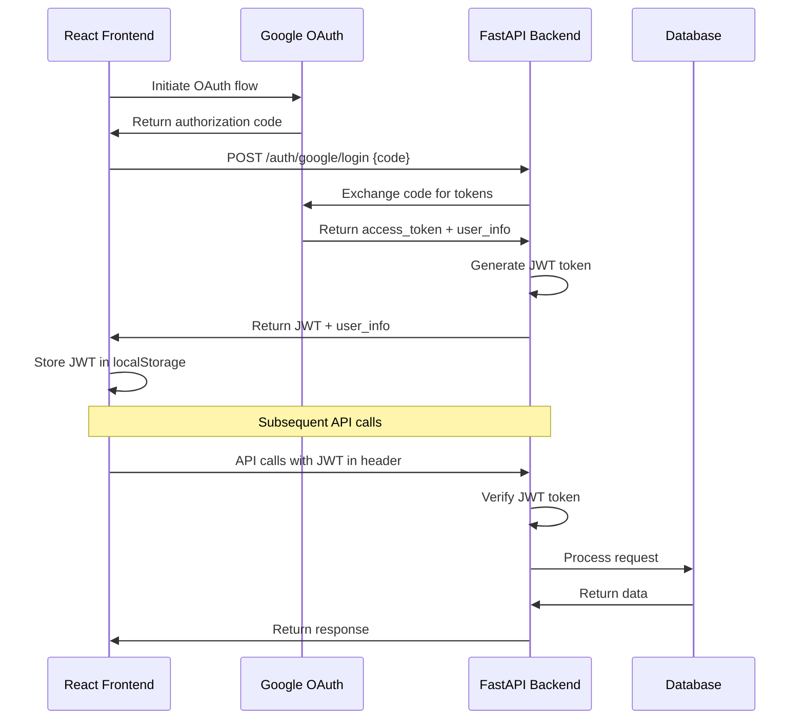

# Google Authentication System

Hệ thống xác thực Google OAuth 2.0 hoàn chỉnh cho FastAPI backend và React frontend.

## 📋 Tổng quan

Hệ thống này xử lý luồng đăng nhập Google OAuth 2.0 sử dụng **authorization code flow**:

1. **React Frontend**: Sử dụng `@google-oauth/google-login` để lấy authorization code
2. **FastAPI Backend**: Nhận authorization code, exchange với Google để lấy tokens và thông tin user
3. **JWT Token**: Tạo JWT token để quản lý session trong ứng dụng

## 🛠️ Cài đặt

### Backend (FastAPI)

```bash
# Cài đặt dependencies
pip install google-auth google-auth-oauthlib PyJWT

# Hoặc từ requirements.txt
pip install -r requirements.txt
```

### Frontend (React)

```bash
# Cài đặt Google OAuth package
npm install @google-oauth/google-login
```

## ⚙️ Cấu hình

### 1. Google Cloud Console

1. Truy cập [Google Cloud Console](https://console.cloud.google.com/)
2. Tạo project mới hoặc chọn project hiện có
3. Enable **Google+ API** hoặc **Google OAuth2 API**
4. Tạo **OAuth 2.0 Client ID** credentials:
   - Application type: Web application
   - Authorized JavaScript origins: `http://localhost:3000`
   - Authorized redirect URIs: `http://localhost:3000`

### 2. Environment Variables (.env)

```bash
# Google OAuth Configuration
GOOGLE_CLIENT_ID=your_google_client_id_here
GOOGLE_CLIENT_SECRET=your_google_client_secret_here
GOOGLE_REDIRECT_URI=http://localhost:3000

# JWT Secret for token signing
JWT_SECRET=your_secret_key_here_change_this_in_production

# Other configurations
MONGODB_URL=mongodb://localhost:27017
DATABASE_NAME=english_server
```

## 🚀 Sử dụng

### 1. Khởi động Backend

```bash
cd english_server
uvicorn app.main:app --reload --host 0.0.0.0 --port 8000
```

### 2. Khởi động Frontend

```bash
cd your-react-app
npm start
```

### 3. Test API

```bash
# Test API endpoints
python scripts/test_api_quick.py

# Test Google authentication flow (cần real auth code)
python scripts/test_google_auth.py
```

## 🔗 API Endpoints

### Authentication Endpoints

| Method | Endpoint | Mô tả |
|--------|----------|-------|
| `POST` | `/api/v1/auth/google/login` | Đăng nhập với Google authorization code |
| `POST` | `/api/v1/auth/verify-token` | Xác minh JWT token |
| `POST` | `/api/v1/auth/refresh-token` | Làm mới Google access token |
| `GET` | `/api/v1/auth/profile` | Lấy thông tin profile từ JWT token |

### Ví dụ Request/Response

**Login Request:**
```json
{
  "authorization_code": "4/0AVMBsJgemoPHnKMzzqpfbxAJ05bEx2zN18hGvhZjPXud7Q3FTJjDzW-O4a5xg-w27mwFCA"
}
```

**Login Response:**
```json
{
  "status": true,
  "message": "Login successful",
  "user_info": {
    "id": "123456789",
    "email": "user@example.com",
    "name": "John Doe",
    "picture": "https://lh3.googleusercontent.com/...",
    "verified_email": true
  },
  "access_token": "ya29.a0ARrdaM...",
  "jwt_token": "eyJhbGciOiJIUzI1NiIsInR5cCI6IkpXVCJ9...",
  "expires_in": 3600
}
```

## 📝 Luồng hoạt động



## 🔧 Files Structure

```
english_server/
├── app/
│   ├── services/
│   │   └── google_auth.py          # Google OAuth service
│   ├── api/v1/
│   │   ├── routes.py               # Auth endpoints
│   │   └── schemas.py              # Request/Response models
├── docs/
│   ├── google_auth_api.md          # API documentation
│   └── react_integration_example.jsx  # React component example
├── scripts/
│   ├── test_google_auth.py         # Comprehensive testing
│   └── test_api_quick.py           # Quick API testing
└── requirements.txt                # Python dependencies
```

## 🧪 Testing

### 1. Backend Testing

```bash
# Test API endpoints accessibility
python scripts/test_api_quick.py

# Test with sample data (will show expected behavior)
python scripts/test_google_auth.py
```

### 2. Frontend Testing

Xem file: `docs/react_integration_example.jsx` để có component React hoàn chỉnh.

## 🔒 Security Best Practices

1. **Environment Variables**: Không commit file `.env` vào git
2. **HTTPS**: Luôn sử dụng HTTPS trong production
3. **JWT Secret**: Sử dụng secret key mạnh và unique cho mỗi environment
4. **Token Expiry**: JWT tokens có thời hạn 7 ngày (có thể điều chỉnh)
5. **CORS**: Cấu hình CORS đúng cách cho production domain

## 🐛 Troubleshooting

### Common Issues

1. **"Google OAuth credentials not found"**
   - Kiểm tra file `.env` có đủ `GOOGLE_CLIENT_ID` và `GOOGLE_CLIENT_SECRET`
   - Restart server sau khi thêm environment variables

2. **"Invalid authorization code"**
   - Authorization code chỉ sử dụng được 1 lần
   - Code có thời hạn ngắn (vài phút)
   - Kiểm tra `redirect_uri` trong Google Console

3. **"Token verification failed"**
   - Kiểm tra `JWT_SECRET` trong `.env`
   - Token có thể đã hết hạn
   - Format header: `Authorization: Bearer <token>`

4. **CORS Issues**
   - Thêm frontend domain vào CORS settings
   - Kiểm tra ports khớp với cấu hình

### Debug Mode

```bash
# Chạy với debug logging
export LOG_LEVEL=DEBUG
uvicorn app.main:app --reload --log-level debug
```

## 📖 Documentation

- **API Docs**: `docs/google_auth_api.md`
- **React Integration**: `docs/react_integration_example.jsx`
- **Auto API Docs**: `http://localhost:8000/docs` (khi server chạy)

## 🤝 Contributing

1. Fork repository
2. Tạo feature branch
3. Commit changes
4. Push và tạo Pull Request

## 📄 License

[MIT License](LICENSE)

---

**🎉 Chúc bạn implement thành công!**

Nếu có vấn đề gì, hãy check:
1. Logs của server: terminal đang chạy uvicorn
2. Browser console: kiểm tra errors từ React
3. Network tab: xem requests/responses
4. Google Cloud Console: kiểm tra OAuth credentials
